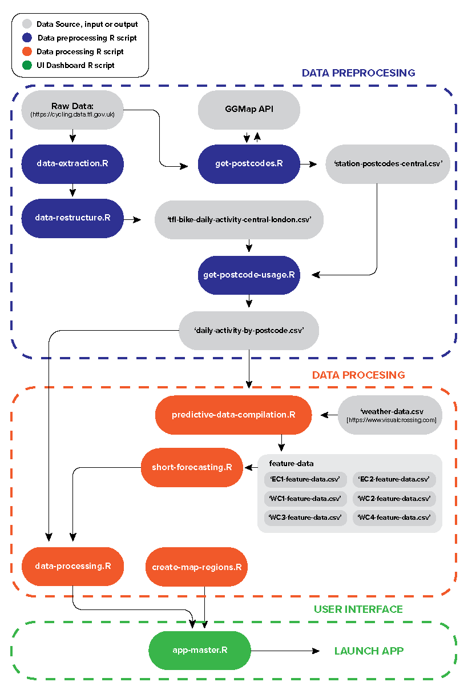

# TFL-Bike-Hire-Forecaster

## How to Use
The UI app and server is created with Rshiny. Open **'app-master.R'**, install the necessary libraries, run the app and open in your browser. 
  

## Product Overview

### The Problem
Transport for London and other stakeholders, such as the primary sponsor Santander, in the TFL bike hire service need to know what areas of central London have the most demand for cycle hire infrastructure. They need to know how many new stations to build in central london to minimise the loss for not meeting demand without over spending uneccessarily.

### The Hypothesis
If we define the ‘activity’ of a single TFL bike hire station as the sum of the number of ‘journey starts’ and ‘journey ends’ in a day, we believed there would be measurable differences in the rate of change of bike hire activity between the different central London postcodes from year to year. We also believed we would be able forecast future changes in activity. This meant we could optimise the amount of new infrastructure to be built to match the increase in demand without over spending. Our hypothesis was correct.

### The Solution
We have produced a map overlay that segments the central London postcodes. User interaction with an individual postcode segment will display descritpive information including prescriptive analytics.

### The Data
TFL have made all trip data from the bike hire scheme available and easily accessible [here](https://cycling.data.tfl.gov.uk). From that link, there is a separate csv file for every 6 days of data from 2016 to 2022 where each entry records a single journey and contains the start and end station, time and date information and the journey duration. We will combine all data sets from 2018 to 2022 and restructure it so that each row instead represents an day from 2018 to mid 2023 and each column is specific to each individual station’s ‘activity’.

### The KPIs
The performance of the forecasting model can be assessed on its accuracy or error in future prediction using a training, validation, and test set. The performance of the product itself would be its quality of forecast. Where the number of new stations that are recommened and the associated loss for TFL can be optimised and validated. 
  

## Code Structure

### Data Preprocessing
This code is located in the data-pre-processing folder. It contains 4 R files. One file, **'get-postcodes.R'**, takes a csv file that can be found [here](https://cycling.data.tfl.gov.uk/usage-stats/371JourneyDataExtract22May2023-28May2023.csv), it identifies all the unique station names before using the google API to identify all the postcodes for the stations before filtering out postcodes that are in central london (EC and WC). It exports a reference file, which can be found in the **'data'** folder from  root directory under the name **'station-postcodes-central.csv'**.

Another file, **'data-extraction.R'**, scrapes and merges all data, found [here](https://cycling.data.tfl.gov.uk/), for every Santander bike journey made since 2018, some processing is done to ensure consistent formatting.

Another file, **'data-restructure.R'**, takes the output csv of this data, it completes various functions to pre process the data, counting every journey started and ended for each central london station and arranges and exports a new csv that presents this data day by day. Missing data has been filled in with mean imputation. The final master dataset can be found in the **'data'** folder from the root directory of this repo with the name **'tfl-bike-daily-activity-central-london.csv'**.

Lastly, we run another script, **'get-postcode-usage.R'**, to count and combine the activity across multiple stations within each central London postcode, WC1, WC2, EC1, EC2, EC3, EC4. We export this data as **'daily-activity-by-postcode.csv'**. Again this can be found in the data folder from the root directory of the app. We use this dataset for processing with the app.

### Server Side Data Processing.
We have a script named **'data-processing.R'** which processes the data from **'daily-activity-by-postcode.csv'** and generates multiple data frames to be referenced by the app server, these frames include descriptive analytics, raw data, smoothed data, forecasted data and values associated with optimsation against a known loss function.

We have another script called **'short-forecasting-data.R'**. This script produces data frames for which we can fit models and learn parameters to forecast future demand for the tfl bike system. It pulls in data from **'weather-data.csv'** to add more features that could contribute to the future prediction of demand.

This leads into the script called **'short-forecasting.R'**. This takes in the data generated and stored in the **'feature-data'** folder in **'data'** and uses features that characterise each day of demand, such as the average demand of different periods leading up to it and weather data, to make a forecast for the following day. We create this model with linear regression, selecting features with intuition and experimentation. We can then display this information on the app.

### App UI
The app itself is made using Rshiny. it is launched from **'app-master.R'**. the Shinydashboard library is used to create the structure of the page with a header, sidebar and body.

The body is used to display the map for which users can interact with. This is done with the leaflet library. The coordinates for the vertices of the central london postcode borders are defined in **'create-map-regions.R'**. These coordinates are called in to **'app-master.R'** and are drawn on to the map using the addPolygons() function. The styling of these are updated every click by observing click events in oder to communicate selected postcode regions to the user.

The sidebar is used to display information about the postcode. Here we give an introductory explanation to define what 'activity' means before providing an overview of each postcode regions's data. Including how many stations are in the postcode region, the mean daily activity accross the available data. And the average daily activity or demand per station in that region. We also give a summary plot to display the smoothed output of the available data to provide the user with an approximate trend of the bike demand in that area.

By scrolling in the sidebar, the user is able to view the prescriptive analytics, with information regarding the forecast for bike demand in the area. As well as the defined loss function to optimise revenue for the TFL and the optimisation itself.
  

## Summary Flow Chart
This graphic summarises the code structure.
  

